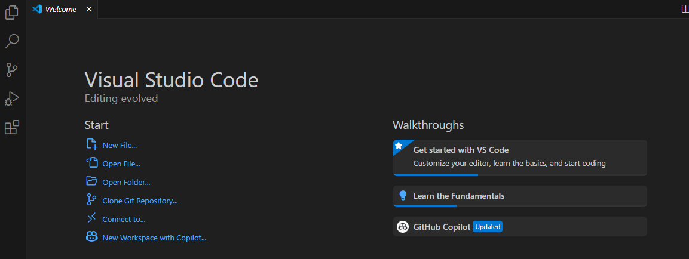
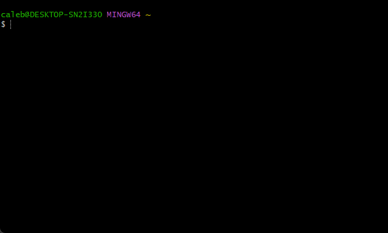
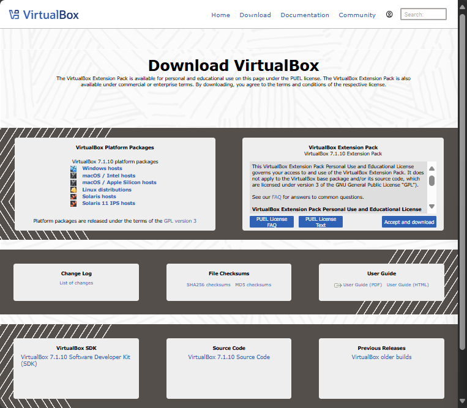
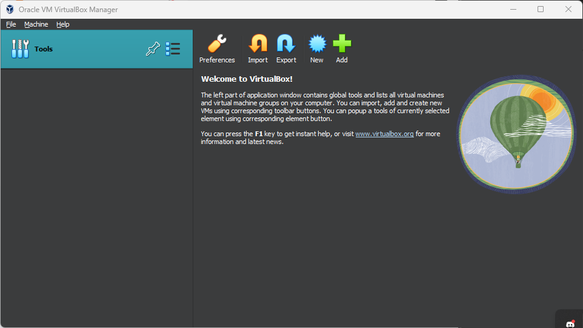
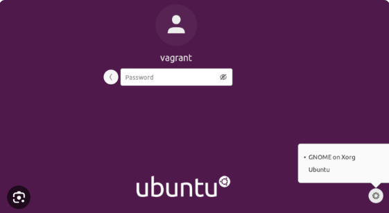
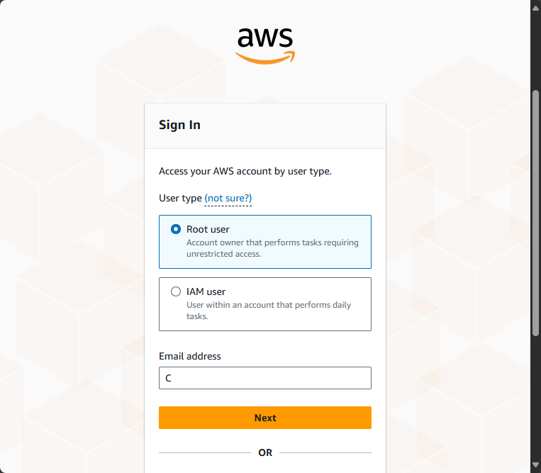
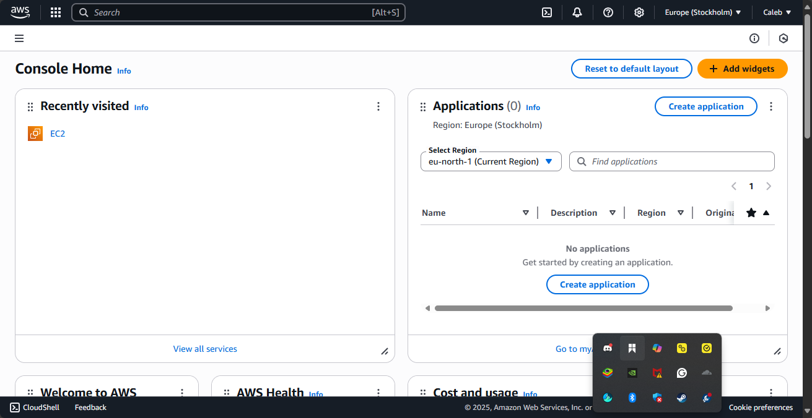

# Tech Environment Setup
## Introduction
This comprehensive installation guide is meticulously crafted to equip students enrolled in the DevOps program with all the necessary tools and resources. The project provides detailed instructions for essential software such as Git, Visual Studio Code (VS Code), VirtualBox, etc., alongside necessary account creation like AWS and GitHub. Each section is carefully linked to official sources for downloads and account setups, ensuring both ease of access and security.

## Project Prerequisites

* **Internet Connection**: Required for accessing cloud services, documentation, and online repositories.

* **Computer**: Adequate performance to run virtual machines and containers (minimum 8GB RAM recommended), 64-bit architecture is highly recommended.

## Tools Needed to Be Installed
1. Visual Studio Code (VS Code)
2. Git
3. VirtualBox
4. Ubuntu on VirtualBox (Windows)

### Accounts to Be Created

1. GitHub account
2. Amazon Web Services (AWS) account

## Visual Studio Code (VS Code)

Visual Studio Code (VS Code) is a free, beginner-friendly code editor made by Microsoft. It’s used to write and edit code for websites, apps, and software in many programming languages like Python, JavaScript, and HTML.
Here’s why beginners love it:
- Simple interface: Clean layout that’s easy to navigate.
- Smart features: It suggests code as you type (called IntelliSense), highlights errors, and helps you fix them.
- Built-in terminal: You can run commands without leaving the editor.
- Extensions: You can add tools for specific languages or tasks with just a few clicks.
- Cross-platform: Works on Windows, macOS, and Linux.
Think of it as your digital notebook for coding—with superpowers. Want help setting it up or choosing your first extension?

### Windows Installation

* **Download VS Code:** Go to the Visual Studio Code website (https://code.visualstudio.com/download)

On the web page, click "Windows" if you are using a Windows system.

* **Run Installer**: Locate the downloaded .exe file, double-click to run the installer.

* **Wizard**: Click "Next" through the installation wizard. Click next to all the remaining prompts.

* **Install**: Lastly, click Install to complete the installation. When installation is complete, click FINISH to complete the installation.

* **Launching VS Code**: Open from the Start Menu, use the desktop shortcut, or simply type "vscode" in the Windows app search.

If installation is successful, it will show this interface:

### Troubleshooting Tips

- **Installer Won't Launch:**  
  - Make sure the file downloaded completely. Try re-downloading the installer.
  - Right-click the installer and select "Run as administrator."
  - Temporarily disable antivirus software if it is blocking the installation.

- **VS Code Doesn't Start:**  
  - Restart your computer and try launching VS Code again.
  - Check Task Manager to ensure VS Code is not already running in the background.
  - Reinstall VS Code if problems persist.

- **Extensions Fail to Install:**  
  - Check your internet connection.
  - Restart VS Code and try again.
  - Make sure you are signed in with the correct account if required.

## Git

Git is a version control system. It helps you keep track of changes in your code or files over time. You can think of it like a save button that also remembers every version you've ever saved.

### Windows installation

* **Download Git:** Go to the Git website for Windows (https://git-scm.com/downloads/win)

On the website, click "Download" to download the Git installer for Windows.

* **Run Installer**: Locate the downloaded .exe file, double-click to run the installer.

* **Options to check if prompted**: If the installer prompts you for options, you can generally accept the defaults unless you have specific preferences.

* **Install**: Lastly, click Install to complete the installation. When installation is complete, click FINISH to complete the installation.

* **Launch Git**: Open from the Start Menu, use the desktop shortcut, or simply type "git" in the Windows app search.

### Troubleshooting Tips
- **Installer Won't Launch:**  
  - Ensure the file is fully downloaded.
  - Right-click and select "Run as administrator."
  - Temporarily disable antivirus software if it is blocking the installer.

- **Git Command Not Found:**  
  - Restart your computer after installation.
  - Make sure Git was added to your system PATH during installation.
  - Open a new terminal or command prompt and try again.

- **Permission Errors:**  
  - Run the terminal or Git Bash as administrator if you encounter permission issues.

## Virtual Box 

VirtualBox is a free, open-source software that allows you to run multiple operating systems on a single computer by creating virtual machines. It acts like a simulated computer within your actual computer, letting you install and use systems like Linux, Windows, or macOS without affecting your main setup. This is especially useful for testing software, learning new operating systems, or running apps that only work on a specific platform. Each virtual machine operates independently, with its own virtual hardware, and you can easily switch between them or delete them without risk to your main system.

### Windows installation
- **Downloa Virtual box**: Go to Oracle virtual box website (https://www.virtualbox.org/wiki/Downloads)

Select the Windows hosr version

- **Run installer**: Locate the downloaded .exe file, double-click to run the installer.

- **Wizard**: Click "Next" through the installation wizard. Click next to all the remaining prompt, leave every option to default.

- **Install Virtual**: Lastly, click install to complete the installation. When installation is complete click FINISH to complete the installation.

- **Launching Virtual box**: Open from the Start Menu, use the desktop shortcut, or simply type "Virtual box" in the Windows app search.

### VirtualBox Troubleshooting Tips

- **Installer Won't Launch:**  
  - Ensure the file is fully downloaded and not corrupted. Try re-downloading if necessary.
  - Right-click the installer and select "Run as administrator."
  - Temporarily disable antivirus software if it is blocking the installer.

- **Installation Fails or Freezes:**  
  - Close any other virtualization software (like VMware) before installing.
  - Restart your computer and try the installation again.
  - Make sure Windows Hyper-V is disabled, as it can conflict with VirtualBox.

- **VirtualBox Won't Start:**  
  - Restart your computer after installation.
  - Run VirtualBox as administrator.
  - Check for Windows updates and install any pending updates.

- **Error: "VT-x/AMD-V hardware acceleration is not available":**  
  - Reboot your computer and enter the BIOS/UEFI settings.
  - Enable virtualization technology (Intel VT-x or AMD-V) in your BIOS/UEFI.
  - Save changes and restart your computer.

- **Network Issues in Virtual Machines:**  
  - Check that the VirtualBox network adapter is enabled in the VM settings.
  - Restart the virtual machine and your host computer if needed.

- **USB Devices Not Detected:**  
  - Install the VirtualBox Extension Pack from the official website.
  - Make sure your user account has permission to access USB devices.

If you continue to experience problems, consult the [VirtualBox User Manual](https://www.virtualbox.org/manual/UserManual.html) or visit the [VirtualBox forums](https://forums.virtualbox.org/).

### Ubuntu (Linux Distro) on Virtual box (Windows Host)
- **Download Ubuntu Desktop ISo file**: Go to Ubuntu official website

- **Virtual Box**: Launch your already installed VirtualBox application on your computer. This is the program that will allow you to create and manage virtual machines.

- **Create a New Virtual Machine**: To create a new VM, click on the "NEW" button or the plus symbol at the top center of the VirtualBox window. This will start the process of setting up a new virtual machine for Ubuntu.

- **Configure the virtual machine**: Choose Linux as the type and Ubuntu as the version. Allocate at least 2GB of RAM for the virtual machine. Cteate a virtual hard disk, choosing either dynamic or fixed size -dynamic recommended-.

- **Select an installation file**: Choose the ubuntu .iso file that we downloaded from ubuntu website.

- **Start the Virtual Machine**:Launch the virtual machine and start the Ubuntu installation process.

- **Install Ubuntu**: When the Ubuntu installer appears, select your language and click "Install Ubuntu." Follow the on-screen instructions to choose your keyboard layout, select "Normal installation," and check "Download updates while installing Ubuntu." Choose "Erase disk and install Ubuntu" (this only affects the virtual disk), and enter your name, computer name, username, and password when prompted.

- **Complete Installation**: Once the installation is complete, you’ll be prompted to restart the virtual machine. Click "Restart Now." If prompted, remove the installation medium (the ISO) by clicking "Devices" > "Optical Drives" > uncheck the Ubuntu ISO. Press "Enter" to reboot. After rebooting, log in with the username and password you created. You now have a fully functional Ubuntu system running in VirtualBox.

## Creating Github and AWS Account
Please note that account creation has nothing to do with the type of OS that you use, since you are dealing with third-party erbs

### Github account

- **Visit the Github Website**: https://github.com/

- **Sign Up**: On the GitHub homepage, you will find a 'Sign up' button. Click on it

- **Enter Your Information**: Fill out the required information on the Sign up page. This typically includes your username, email adress, and password. Choose a dtrong and secure password.

- **Verify your email**: After entering your information, Github will ask you to verify your email address. Check your emailinbox for a verification message from GitHub and click on the verification link.

- **Complete the CAPTCHA**: Github may ask you to complete a CAPTCHA to ensure that you are not a robot. Follow the instruction to prove you're a human.

- **Choose a Plan**: Github offers free plans for public repositories and paid plans for private repositories. Choose the plan that best suits your needs.

- **Tailor Your Experience(Optional)**: Github may ask you to answer a few questions to tailor your experience. You can choose to answer them or skip this step. GitHub may ask you to answer a few questions to tailor your experience. You can choose to answer them or skip this step.

- **Welcome to Github**: Once you've completed the above steps, you should be redirected to your new GitHub account. You now have a GitHub account.

- **Explore GitHub**: Take some time to explore the GitHub platform. Familiarize yourself with the interface, and you can start by creating a new repository if you have a project in mind.

### Amazon Web Service (AWS) Account

- **Visit the AWS Free Tier Page**: Go to the AWS free tier page at AWS website to learn about the services available in the free tier and to start the signup process (https://aws.amazon.com/console/)

- **Create an AWS Account**: On the AWS free tier page click on the 'Create an AWS Account' button.

- **Provide account information** Fill in the necessary account information, including yout contact information and payment details. Note that you'll be required to provide valid credit card information. even though you won't be charged unless you exceed the free teir limits. You will be required to have a minimum of 1 usd in your card.

- **Verify your identity**: Follow the steps to verify your identity. This may involve receiving a phone call or entering a verification code sent to your email or phone.

- **Choose a support plan**: AWS offers a free support plan, but you can choose to upgrade to a paid plan if you prefer. For the free tier, the basic support plan is usually sufficient.

- **Enter payment information**: As part of the account setup, you'll need to enter valid credit card information. AWS uses this for identity verification and to prevent abuse of the free tier resources.

- **Review and confirm**: Review the information you provided, read the terms and conditions, and confirm your agreement.

- **Wait for approval**: It might take a short while for your account to be approved. Once approved, you'll receive a confirmation email.

- **Access the AWS Management Console**: After receiving confirmation, log in to the AWS Management Console using new account credentials.

- **Explore the AWS Free Tier services**: AWS offers a variety of services within the free tier, including EC2 (Elastic Compute Cloud), S3 (Simple Storage Service), and more. Make sure to explorw and understand the limitation of each service within the free tier.

