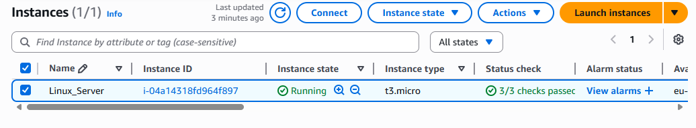
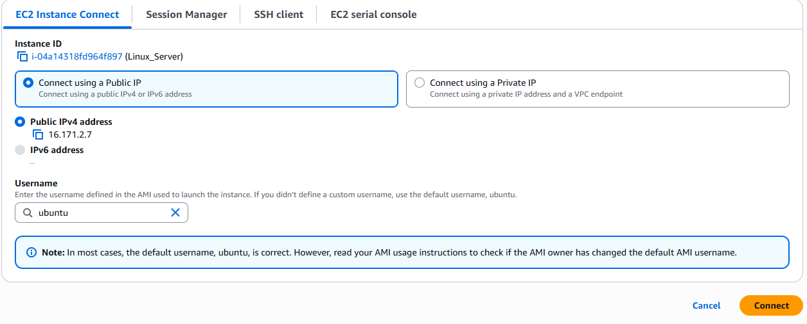
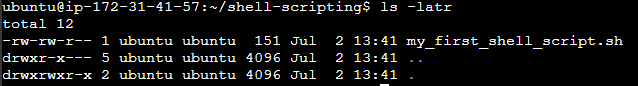
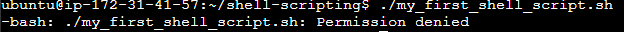
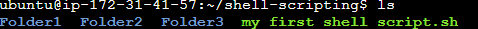
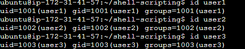
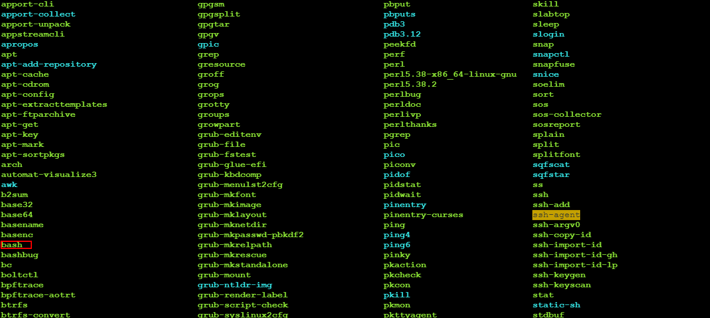
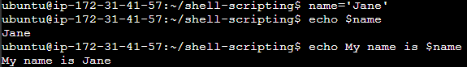

# Linux Shell Scripting

## Introduction
With the thousands of commands available to the command line user, how can we remember them all? The answer is, we don't. The real power of the computer is its ability to do the work for us. To do that, we use the power of the shell to automate things. We write shell scripts.

## What is Shell Scripting
Imagine you are tasked with setting up new workstations and user accounts regularly at your job. Instead of manually creating each folder and user account, a simple shell script serves as your efficient digital helper. By automating the creation of multiple directories and user accounts with just a few lines of code, it saves you considerable time and effort, allowing you to concentrate on more critical aspects of your work.

Shell scripting is the process of writing and executing a series of instructions in a shell to automate tasks. A shell script is essentially a script or program written in a shell language, such as `Bash`, `sh`, `zsh`, or `PowerShell`.

### Task 1

1. Create a folder on an Ubuntu server and name it shell-scripting

    - First, log in to the AWS console, where you can access the EC2 instance already created. Then click on Instance State and select "Start instance."
    
    - Connect to the instance using your preferred method, either SSH or EC2 Instance Connect.
    

    - Once you are on the Ubuntu server, make the directory using:
    ~~~
    mkdir shell-scripting 
    ~~~

2. Using the `vim` editor, create a file called **my_first_shell_script.sh**
~~~
vim my_first_shell_script.sh
~~~

3. Put this shell script code into the file:
~~~
#!/bin/bash

# Create directories
mkdir Folder1
mkdir Folder2
mkdir Folder3

# Create users
sudo useradd user1
sudo useradd user2
sudo useradd user3

~~~

4. Use the `cd` command to change into the **shell-scripting** directory.

5. Use the `ls -latr` command to confirm that the file has been created.

Something to take notice of about the permissions of the newly created file is this **-rw-rw-r--** which means:
1. The owner of the file has read (r) and write (w) permissions.
2. Members of the file's group have the read (r) permission.
3. Others have the read (r) permission.

However, no one has the execute permission, so the script cannot be executed.

To execute the script, you would typically do something like this:
~~~
./my_first_shell_script.sh
~~~

The `./` prefix to the file indicates that the command should look for the file in the current directory.

However, when you hit enter, you will receive a response saying "Permission denied."

This can be solved by giving the file the necessary permission it requires.

As you notice, there is a **bash** at the beginning of the error message. It indicates that the error message is coming from the **Bash shell** itself. **Bash** is the command interpreter or shell that you are using in the terminal to execute commands.

### Task 2

1. Add the execute permission for the **owner** to be able to execute the shell script.
~~~
chmod u+x my_first_shell_script.sh
~~~

After running this command, the owner of the file will be able to execute (run) the shell script directly from the terminal.
2. Run the shell script.
~~~
./my_first_shell_script.sh
~~~

3. Evaluate and ensure that 3 folders are created.
To verify that the folder has been created simply use the `ls` command

4. Evaluate and ensure that 3 users are created on the Linux server.
To verify that the users have been created simply use the `id`
input these commands seperately 
~~~
id user1

id user2

id user3
~~~

## What is a Shebang (#!/bin/bash)?

Notice at the beginig of the shell script, we have `#!/bin/bash` written there. This si what is called a **shebang**. It is a special notation used in Unix-like operating systems like Linux, to specify the interpreter that should be used to execute the script. In this case, #!/bin/bash specifically indicates that the **Bash** shell should be used to interpret and execute the script.

You can explure the **/bin** folder and see the different programs in there. **Bash** is one of them which is used as the interpreter in that script. If we wanted to use another shell like sh, the shebang would be updated to `#!/bin/sh`

**/bin/bash**: This is the absolute path to the Bash shell executeable. It tells the system to use the Bash interpreter located at /bin/bash to run the script.

Without a shebang line, the system may not know how to interpret and execute the script, and may need to explicitly specify the interpreter when running the script.

## Variable Declaration and Initialization:

In programming generally not just shell scripting, **variable** are essential for creating dynamic and flexible programs.

Variable can store data of various types such as numbers, strings, and arrays. You can assign values to variables using the **=** operator, and access their values using the variable name preceded by a $ sign.

For example:
~~~
name="Jane"
~~~

From the exampel above, **Jane** was assigned to the variable **name**

Now that the variable is assigned,we will display how to use it

### Retrieving value from a variable

After assigning a value to a variable, as shown in the previos example where we assigned 'John' to the variable name, you can utilize this variable in various ways in your script or program. One of the most straightforward methods to use or retrieve the value stored in a variable is by echoing it back to the console. This is done using the **echo** command in shell scripting.
~~~
echo $name
~~~

This command instructs the shell to print the value of name to your screen which in our case, would output **Jane**

