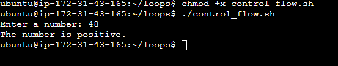
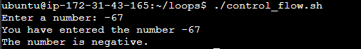

# Linux Shell Scripting (Control Flow)

## Introduction
Control flow statements are the backbone of making decisions in programming. In scripting, these statments let your scripts decide what to do or how to procedeed based on conditions, loops, or user inputs.

Bash and other shell interpreters provdes control flow statements like
- **if-else**
- **for** loops
- **while loops** and
- **case** statements to control the flow of execution in your scripts.

This project will focus on the **if-else** and **for** loops.

## What is Control Flow?
In simple terms, control flow directs the order in which commands or introductions are executed in the script. It's like a roadmap that decides which path to take based on certain conditions or how many times to visit a place.

Let's examine an **if-else** statement in Bash to understand how it makes decisions based on user input.

### The Task

The main script this project will cover, asks for a number and then tells us if that number is positive, negative, or zero.

1. Create a file and name it **control_flow.sh**
~~~
vim control_flow.sh
~~~
2. Input this script.
~~~
#!/bin/bash

read -p "Enter a number: " num

if [ $num -gt 0 ]; then
    echo "The number is positive."
elif [ $num -lt 0 ]; then
    echo "The number is negative."
else
    echo "The number is zero"
fi
~~~
#### The Script Breakdown
- **#!/bin/bash**: This line is the shebang; it tells the system this script should be run with **Bash** interpreter
- **read -p "Enter a number:"**: This command asks you, the user, to enter a number. The **-p** option allows us to display a prompt message on the screen when you execute the script.
####

3. Execute the script
It is important to allows the user the ability to execte the file
~~~
chmod u+x control_flow.sh
~~~
This allows the user the ability to input this command
~~~
./control_flow.sh
~~~

Allowing the ability to execute the file

Notice that when you execute the script, It just asks you to **Enter a number:**. Even when you type a number and hit enter, it takes the number, but you can not visibly see what it does with the number. That is because the **read** command in the script has its own way of taking inputs from the user, and storing the value into a variable passed to the **read** command.

The **read** command is used to capture input and store it in a variable. When you use **read** followed by a variable name (in the case of our script, num). Bash waits for the user to enter something into the command line (stdin). Once the user presses enter, **read** assigns the input to the variable.

Now lets make the script make more sense, by updating the code below and execute:
~~~
#!/bin/bash
read -p "Enter a number: " num
echo "You have entered the number $num"
~~~

This is the new execution

Notice how we have now used **echo** to return back to the screen **(stdout)** the value stored in the `$num` variable.

Since we now have something stored in the `$num` variable, we can use control flow to determine what the script execute next.

## if statement
The if statement in Bash scripts allows you to execute commands based on conditions. The basic synax is:
~~~
if [ condition ]; then
    commands
fi
~~~
    
- **if**: This keyword starts the conditional statement.
- **[ condition ]**: The condition to evaluate. Brackets [] are used to enclose the condition being tested.
- **then**: If the condition is true, execute the commands that follows this keyword.
- **fi**: Ends the if statement. It's basically **if** spelled backword, indicating the conclusion of the conditional block.

An example of 