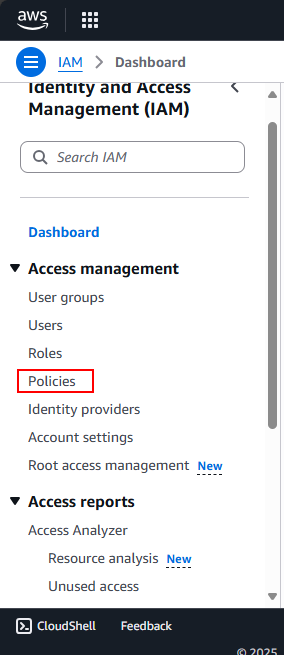
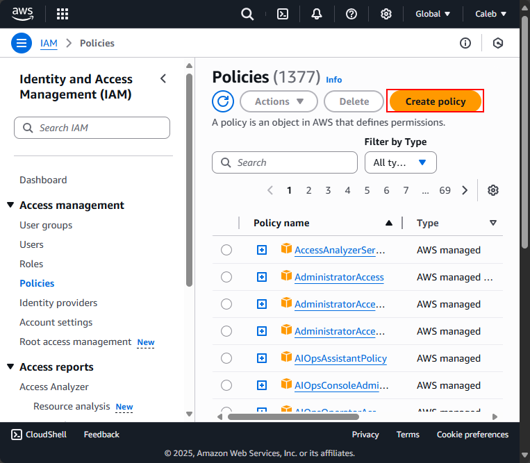
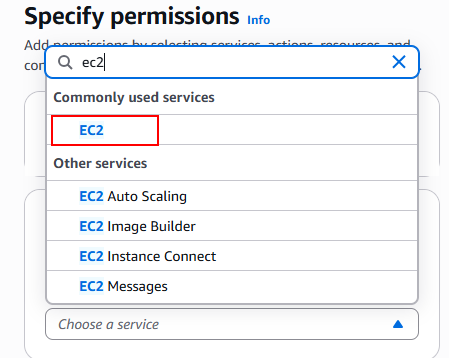
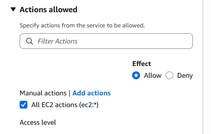
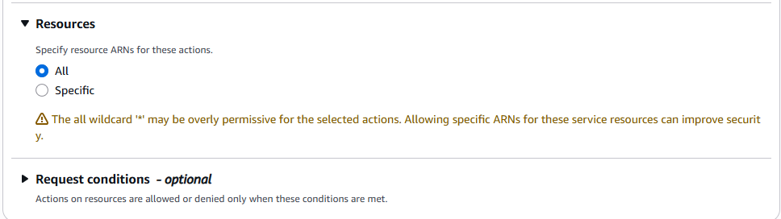
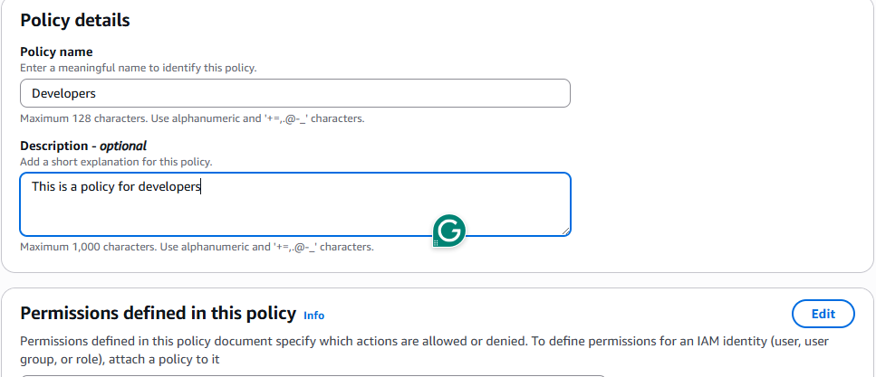
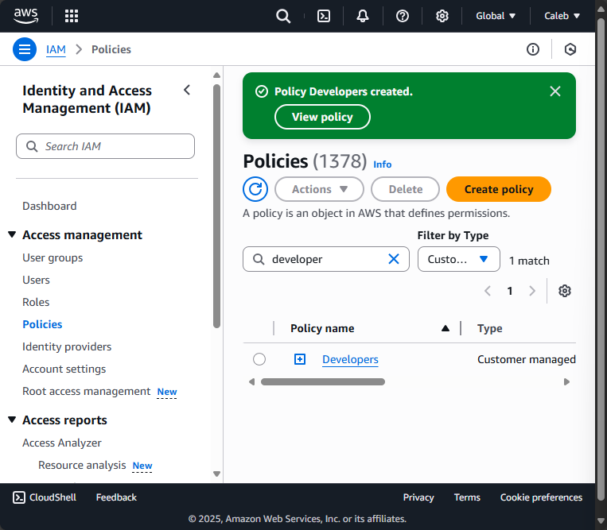

# Introduction to Cloud Computing - Security & Identity Management (IAM)

# AWS IAM Project: Zappy e-Bank

## Project Overview

This mini project explores the foundations of **Amazon Web Services (AWS) Identity and Access Management (IAM)** through the lens of a fintech startup—**Zappy e-Bank**. It simulates how real-world organizations establish secure, scalable, and role-specific access to cloud resources.

> Skill Focus: IAM fundamentals, roles, users, policies, and best practices

---

## Introduction to Cloud Computing

Before diving into IAM, it's essential to understand cloud computing at a high level:

- Cloud computing delivers services like **servers, storage, databases, and networking** over the internet.
- It powers innovation, scalability, and cost-efficiency for businesses across industries.

Zappy e-Bank aims to harness the cloud's potential to build a robust and secure financial platform.

---

## Importance of IAM for Zappy e-Bank

For a fintech startup, security and compliance are non-negotiable. The company must ensure that it's data, including sensitive customer informationm is securely managed and that access to resources is tightly controled. IAM enables:

- **Secure User Access:** Create and manage AWS users and groups
- **Granular Permissions:** Set fine-grained policies using roles
- **Enhanced Security:** Implement multi-factor authentication (MFA)

Through this project, you'll gain hands-on experience applying IAM concepts in a realistic cloud environment.

---

## Project Goals and Learning Outcomes

By completing this project, you will:

- Understand IAM components: users, groups, roles, and policies
- Learn how to manage access via the AWS Management Console
- Apply security best practices for cloud infrastructure
- Appreciate the impact of access control on compliance and data integrity

---

## Project Setup

1. **Log in to the AWS Management Console**
   - Use your administrator account.

2. **Navigate to the IAM Dashboard**
   - Manage users, groups, roles, and policies.

---
## Exercise
### Creating IAM Users
An IAM user is a unique identity within an AWS account that represents a person or service, granting specific permissions to access and interact with AWS resources under controlled and customisable security policies.

Imagine that you have a big secure building __(AWS account)__ that you own and control. When you first get the keys to this building, you're given a master key **(root user)** that can open every door, access every floor, and make changes to the building's structure itself.

This masterkey is powerful, allowing you to do anything from adding new rooms (services) to changing the locks (security settings). However, because this key can do so much, it's also very risky to use it for daily tasks- like if you lost it, someone could do anything they want with your building.

Now, imagine you have specific tasks that need to be done in the building, like cleaning, maintenance, or security checks. You would not give out the master key to every person who needs to do those jobs. Instead, you create specific keys (IAM users) that can only open certain doors to access certain floors. These keys are less powerfol but much safer to use for everyday tasks. They ensure that the people holding them can only access the parts of the building they need to do their jobs and nothing more.

Let's set up IAM users for a backend developer, **John** and a data analyst, **Mary**, by first determining their specific access needs.

As a backend developer, John requires access to servers **(EC2)** to run his code, necessitating an IAM user with policies granting EC2 access.

As a data analyst, Mary needs access to data storage **(AWS S3 service)**, so her IAM user should have policies enabling S3 access

Considering **Zappy e-Bank's** plan ot expand its team with 10 more developers and 5 additional data analyst in the coming months, it's inefficient to individually create similar policies for each new member. A more streamlined approach involves:

1. Crafting a single policy tailored to each role access requirements.

2. Associating this policy with a group specifically designed for that role.

3. Adding all engineers and analysts to their respective groups, simplifying the management of permissions and ensuring consistent access across the team.

### Creating policy for the Development team
1. In the IAM console, click on policies.

2. Click on create policy

3. In the select a service selection, search for ec2

4. For simplicity sake, select the **<u>All EC2 actions</u>** checkbox.

5. Also, make sure to select **"All"** in the resources section

6. Click Next

7. Provide the name **developers** and description for the policy.

8. Click on **Create Policy**

> Notice that after creating the policy, if you search for "developer" in the search box, you will notice that a number of policies are returned. This highlights the presence of both AWS managed and customer managed policies. AWS managed policies are predefined by AWS and provide permissions for many common use cases, allowing for quick and broad access management across AWS services without the need for custom policy creation like we just did. In contrast, customer managed policies are created and fully controlled by you, allowing for more tailored, specific access controls that can be finely tuned to your organization's requirements.

### Create policy for the Data Analyst team

Repeat the process above for the Data