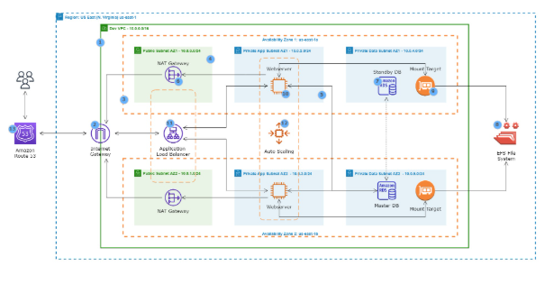

# WordPress Site on AWS

## Project Scenario

A small to medium-sized digital marketing agency, **"DigitalBoost"**, wants to enhance its online presence by creating a hagh-performance **WordPress-based** website for their clients. The agency needs a scalable, secure, and cost -effective solution that can handle increasing traffic and seamlessly intergrate with their existing infrastructure. Yor task as an AWS solutions Architect is to design and implement a WordPress solution using various AWS services, such as Networking, Computue, Object Storage, and Databases.

## Pre-requisite

- Knowledge of TechOps Essentials
- Comletion of Core 2 Courses and Mini Projects

The project overview with necessary architecture have been provided as you help **DigitalBoost** with the WordPress Based website. 

## Project Deliverables

- **Documentation:**
    - Detailed documentation for each component setup
    - Explanation of security measures implemented

- **Demonstation:**
    - Live demonstation of the WordPress site.
    - Showcase auto-scaling by simulating increased traffic

## Project Overview

1. **VPC** with public and private subnets in 2 availability zones

2. An **Internet Gateway** is used to allow communication between instances in VPC and the internet 

3. We are using 2 **availbility zones** for high availability and fault tolerance.

4. Resources such as Nat Gateway, Bastion Host, and Application Load Balancers uses public subnet

5. We will put the webservers and database server in the Private Subnets to protect them.

6. The **Nat Gateway** allows the instances in the private App subnets and private Data subnets to access the internet.

7. We are using an **MySQL RDS** database.

8. We are using Amazon EFS so that the webservers cn have access to shared files.

9. The **EFS Mount Targets** are in each Availability Zones in the VPC

10. We are using **EC2 Instances** to host our website

11. **Application Load Balancer** is used to distribute web traffic accross an Auto Scaling Group of EC2 Instances in multiple AZs

12. Using **Auto-scalling Group** to dynamically create our EC2 instances to make our website highly available scalable, fault tolerance, and elastic

13. We are using **Route 53** to register our domain name and create a record set

## Project Components 

### 1. VPC Setup

**VPC ARCHITECTURE**

1. **VPC** with public and private subnets in 2 availability zones.

2. An **Internet Gateway** is used to allow communication between instances in VPC and the internet.

3. We are using 2 **Availability Zones** for high availability and fault tolerance.

4. Resources such as Nat Gateway, Bastion Host, and Application Load Balancer uses **Public Subnets**.

5. We will put the webserver and database server in the **Private Subnets** to protect them.

6. The **Public Route Table** us associated with the public subnets and routes traffic to the internet through the internet gateway.

7. The **Main Route Table** is associated with the private subnets

#### Objectives and Steps
- **Objective:** Create a Virtual Private Cloud (VPC) to isolate and secure the WordPress infrastructure.

- **Steps**
    - Define IP address range for the VPC.
    - Create VPC with public and private subnets.
    - Configure route tables for each subnet.

####  Create VPC

### 2. Public and Private Subnet with NAT Gateway
**NAT GATEWAY ARCHITECTURE**

1. The **Nat Gateway** allows the instances in the private App subnets and private Data subnets to access the internet.

2. The **Private Route Table** is associated with the private subnets and routes traffic to the internet through the nat gateway.

#### Objectives and Steps

- **Objective:** Implement a secure network architecture with ublic and private subnets. Use a NAT Gateway for private subnet internet access.

- **Steps:**
    - Set up public subnet for resources accessible from the internet.
    - Create private subnet for resources with no direct internet access.
    - Configure a NAT Gateway for private subnet internet access

### 3. AWS MySQL RDS Setup

**SECURITY GROUP ARCHITECTURE**

1. **ALB Security Group**

    **Port**= 80 and 443       |     **Source**= 0.0.0.0/0

2. **SSH Security Group**

    **Port**=22   | **Source**= Your IP Address

3. **Webserver Security Group**

    **Port**= 80 and 443 | **Source**= ALB Security Group

    **Port**= 22 | **Source**= SSH Security Group

4. **Database Security Group**

    **Port**= 3306 | **Source**= Webserver Security Group

5. **EFS Security Group**

    **Port**=2049 | **Source**= Webserver Security Group,EFS Security Group

    **Port**=22 | **Source**= SSH Security Group

#### Objectives and Steps
- **Objectives:** Deploy a managed MySQL database using Amazon RDS for WordPress data storage.

- **Steps:**
    - Create an Amazon RDS instance with MySQL engine
    - Confugure security groups for RDS instances.
    - Connect WordPress to the RDS dab=tabase.

### 4. EFC Setup for WordPress Files 

- **Objective:** Utilise amazon Elastic File System (EFS) to store WordPress files for scalable and shared access.

- **Steps:**
    - Create an EFS file system.
    - Mount the EFS file system on WordPress instances.
    - Configure Wordpress to use the shared file system.

### 5. Application Load Balancer
- **Objective:** Set up an Application Load Balancer to distribute incoming traffic among multiple instances, ensuring high availability and fault tolerance.

- **Steps**
    - Create an Application Load Balancer.
    - Configure listener rules for routing traffic to instances.
    - Integrate Load Balancer with Auto Scaling group.

### 6. Auto Scaling Group

- **Objective:** Implement Auto Scaling to automatically adjust the number of instances based on traffic load.

- **Steps:**
    - Create an Auto Scaling group
    - Define scaling policies based on metrics like CPU utilisation.
    - Configure launch configurations for instances.

## Core Architecture Summary
Here’s a simplified view of the major components and their roles:

| Component | Purpose | 

| VPC | Isolates resources into public/private subnets across 2 AZs |

| Internet Gateway | Enables internet access for public subnet resources | 

| NAT Gateway | Allows private subnet instances to access the internet securely | 

| EC2 Instances | Hosts the WordPress application | 

| Application Load Balancer | Distributes traffic across EC2 instances | 

| Auto Scaling Group | Dynamically adjusts EC2 count based on traffic | 

| Amazon RDS (MySQL) | Stores WordPress data in a managed DB | 

| Amazon EFS | Provides shared file storage for WordPress instances | 

| Route 53 | Manages domain name and DNS records | 

| Security Groups | Controls inbound/outbound traffic for each component | 

