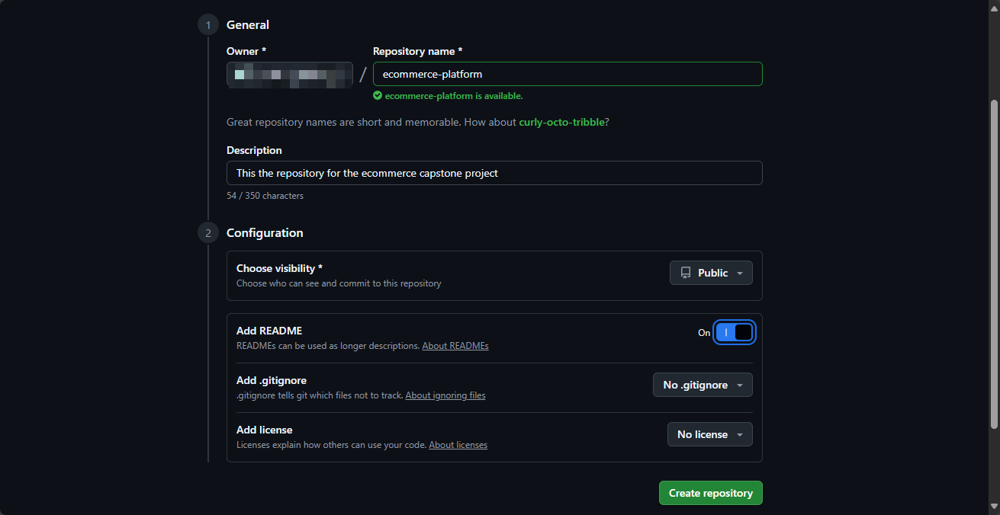
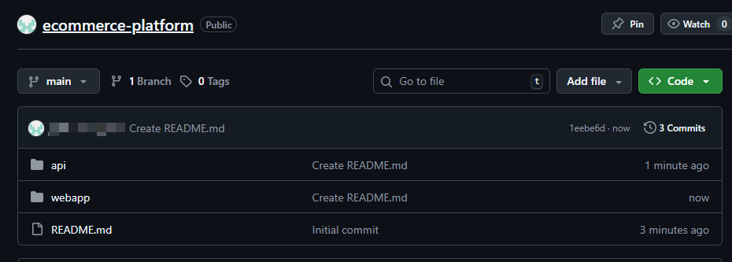
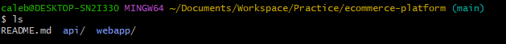
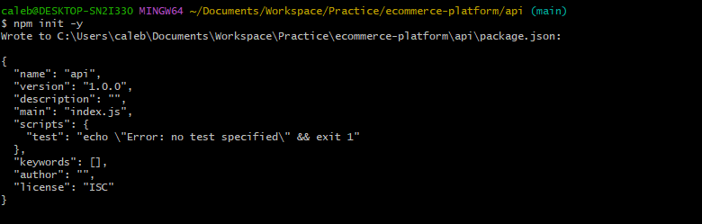
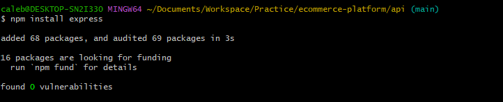
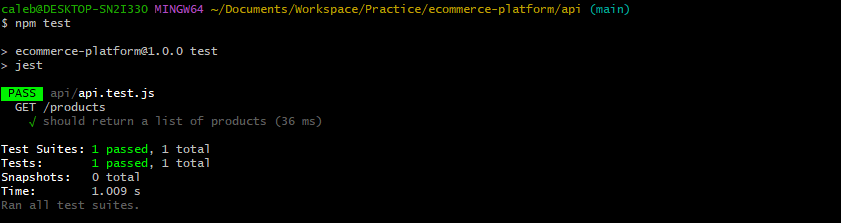
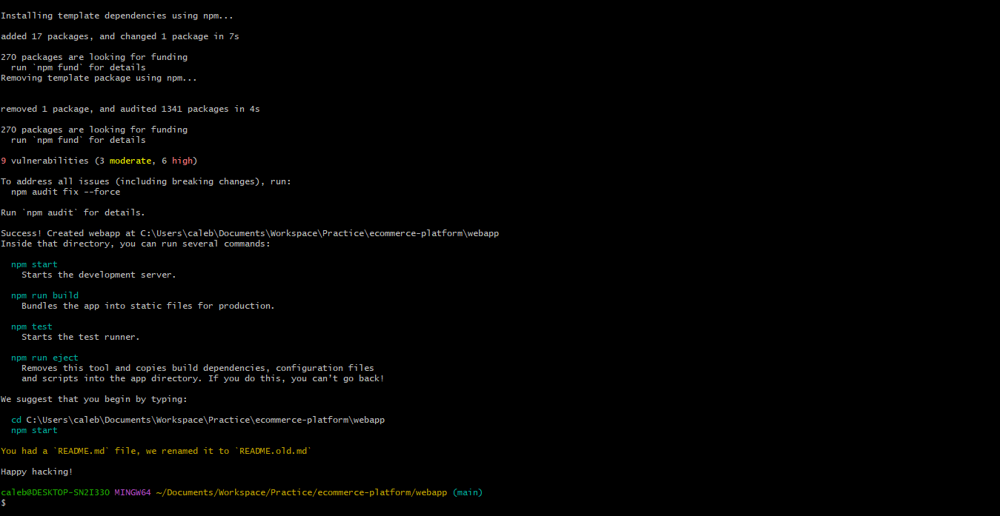
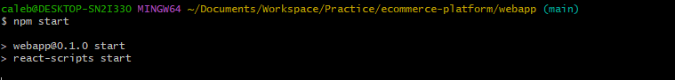
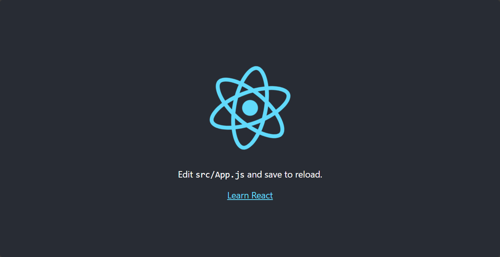

# Capstone Project: E-Commerce Application CI/CD Pipeline

##  Project Overview

This project simulates a real-world scenario where you're responsible for building and maintaining a CI/CD pipeline for an e-commerce platform with two main components:

-   **E-Commerce API**: Backend service for product listings, user accounts, and order processing.
-   **E-Commerce Frontend**: Web application for browsing products, managing accounts, and placing orders.

The goal is to automate integration and deployment using **GitHub Actions**, ensuring continuous delivery and integration.

---

##  Project Tasks

###  Task 1: Project Setup

- Create a GitHub repository named `ecommerce-platform`.

 

- Inside the repository, create two directories:
  - `api` for the backend.
  - `webapp` for the frontend.

  

### Task 2: Initialize GitHub Actions

- Initialize a Git repository and add your initial project structure.
    
    Step 1: Navigate to the repository you want on your local machine.

    ```bash 
    cd desired-path
    ```
    Step 2: Clone Git repository to your local machine.


    ```bash
    git clone <your-repo-url>

    ```
    Step 3: Navigate into the cloned repository.

    ```bash
    cd ecommerce-platform
    ```

    


- Create a `.github/workflows` directory for GitHub Actions.

    ```bash
    mkdir -p .github/workflows
    ```

### Task 3: Backend API Setup

- In the `api` directory:
  - Set up a Node.js/Express application for basic e-commerce operations.
    
    First enter the `api` directory.

    ```bash 
    cd api
    ```

    Then initialize a Node.js project.

    ```bash
    npm init -y
    ```
    

    Install Express.js.

    ```bash
    npm install express
    ```
    


  - Implement unit tests for your API.

    Install Jest for testing.

    ```bash
    npm install --save-dev jest
    ```

    Install Supertest for API testing.

    ```bash
    npm install --save-dev supertest
    ```

    Add a test script in `package.json`.

    ```json
    "scripts": {
      "test": "jest"
    }
    ```

    Create a simple test file `api.test.js`.

    ```javascript
    const request = require('supertest');
    const app = require('./app'); // Your Express app

    describe('GET /products', () => {
      it('should return a list of products', async () => {
        const res = await request(app).get('/products');
        expect(res.statusCode).toEqual(200);
        expect(res.body).toHaveProperty('products');
      });
    });
    ```

    Create a simple Express app in `app.js`.

    ```javascript
    const express = require('express');
    const app = express();

    app.get('/products', (req, res) => {
    res.json({ products: [] });
    });
     

    module.exports = app;
    ```

    Create a server file `server.js` to run the app.

    ```javascript
    const app = require('./app');

    const PORT = process.env.PORT || 5000;

    app.listen(PORT, () => {
    console.log(`Backend server running on port ${PORT}`);
    });
    ```
    This code sets up a basic Express server with a single endpoint `/products` that returns an empty list of products.

    Start the backend server.

    ```bash
    node server.js
    ```
    Run tests to ensure everything is set up correctly.

    ```bash
    npm test
    ```
    

    

### Task 4: Frontend Web Application Setup

- In the `webapp` directory:
  - Create a React application that interacts with the backend API.

    First enter the `webapp` directory.

    ```bash 
    cd ../webapp
    ```

    Create a React app using Create React App.

    ```bash
    npx create-react-app .
    ```
    The npx command downloads and runs the Create React App tool to set up a new React project in the current directory.

    

    Start the React development server to ensure it's working.

    ```bash
    npm start
    ```
    This command starts the React development server, allowing you to view your application in a web browser.

    

    


  - Include features like product listing, user login, and order placement.

    You can use React Router for navigation and Axios for API calls.

    Install React Router.

    ```bash
    npm install react-router-dom
    ```
    This command installs the React Router library, which is used for handling navigation and routing in React applications.

    Install Axios.

    ```bash
    npm install axios
    ```
    This command installs the Axios library, which is used for making HTTP requests from the React application to the backend API.

    Create basic components for product listing, user login, and order placement.

    Example of a simple product listing component:

    first create a new file named `ProductList.js` in the `src` directory of your React app.

    ```bash
    cd src
    touch ProductList.js
    ```

    Then add the following code to `ProductList.js`:

    ```javascript
    import React, { useEffect, useState } from 'react';
    import axios from 'axios';

    const ProductList = () => {
      const [products, setProducts] = useState([]);

      useEffect(() => {
        axios.get('http://localhost:5000/products') // Adjust the URL as needed
          .then(response => setProducts(response.data.products))
          .catch(error => console.error('Error fetching products:', error));
      }, []);

      return (
        <div>
          <h1>Product List</h1>
          <ul>
            {products.map(product => (
              <li key={product.id}>{product.name}</li>
            ))}
          </ul>
        </div>
      );
    };

    export default ProductList;
    ```
    This component fetches a list of products from the backend API and displays them.

    Integrate the `ProductList` component into your main `App.js` file.

    ```javascript
    import React from 'react';
    import { BrowserRouter as Router, Routes, Route } from 'react-router-dom';
    import ProductList from './ProductList';

    function App() {
      return (
          <Router>
            <Routes>
              <Route path="/" element={<ProductList />} />
            {/* You’ll add login and order routes here later */}
            </Routes>
        </Router>
      );
    }
    export default App;
    ```
    Install React Testing Library for testing.

    ```bash
    npm install --save-dev @testing-library/react @testing-library/jest-dom
    ```
    Create a simple test for the `ProductList` component in `ProductList.test.js`.

    ```bash
    touch ProductList.test.js
    ```

    ```javascript
    import { render, screen } from '@testing-library/react';
    import App from './App';
    import '@testing-library/jest-dom';

    test('renders product list heading', () => {
      render(<App />);
    const heading = screen.getByText(/Product List/i);
    expect(heading).toBeInTheDocument();
    });
    ```

    Run frontend tests.

    ```bash
    npm test
    ```
    This command runs the test suite for your React application, allowing you to verify that your components and functionality are working as expected.


### Task 5: Continuous Integration Workflow

- Create GitHub Actions workflows for both backend and frontend that:

    - Install dependencies.
    - Run tests.
    - Build the application.

The first step is to create a workflow file for the backend API.
    Create a file named `backend-ci.yml` in the `.github/workflows` directory.

    ```bash
    cd ../../.github/workflows
    touch backend-ci.yml
    ```

    Add the following content to `backend-ci.yml`:

    ```yaml
    name: Backend CI

    on:
      push:
        branches: [ main ]
      pull_request:
        branches: [ main ]

    jobs:
      build:
        runs-on: ubuntu-latest

        steps:
        - uses: actions/checkout@v2
        - name: Set up Node.js
          uses: actions/setup-node@v2
          with:
            node-version: '14'
        - name: Install dependencies
          run: |
            cd api
            npm install
        - name: Run tests
          run: |
            cd api
            npm test
    ```

    This workflow triggers on pushes and pull requests to the `main` branch, checks out the code, sets up Node.js, installs dependencies, and runs tests for the backend API.

### Task 6: Docker Integration

- Create Dockerfiles for both backend and frontend.
 
 This will be done in the respective directories.

  In the `api` directory, create a `Dockerfile`.
  
  ```bash
  cd ../../api
  touch Dockerfile
  ```
  Add the following content to the `Dockerfile`:

  ```Dockerfile
  # Use an official Node.js runtime as a parent image
  FROM node:14  
  # Set the working directory
  WORKDIR /usr/src/app
  # Copy package.json and package-lock.json
  COPY package*.json ./
  # Install dependencies
  RUN npm install
  # Copy the rest of the application code
  COPY . .
  # Expose the port the app runs on
  EXPOSE 5000
  # Start the application
  CMD ["node", "server.js"]
  ```
  In the `webapp` directory, create a `Dockerfile`.

  ```bash
  cd ../webapp
  touch Dockerfile
  ```
  Add the following content to the `Dockerfile`:
  
  ```Dockerfile
  # Use an official Node.js runtime as a parent image
  FROM node:14
  # Set the working directory
  WORKDIR /usr/src/app
  # Copy package.json and package-lock.json
  COPY package*.json ./
  # Install dependencies
  RUN npm install
  # Copy the rest of the application code
  COPY . .
  # Build the React app
  RUN npm run build
  # Install serve to serve the build
  RUN npm install -g serve
  # Expose the port the app runs on
  EXPOSE 3000
  # Start the application
  CMD ["serve", "-s", "build"]
  ```


- Modify GitHub Actions workflows to build Docker images.

  Create a file named `docker-build.yml` in the `.github/workflows` directory.

  ```bash
  cd ../../.github/workflows
  touch docker-build.yml
  ```

  Add the following content to `docker-build.yml`:

  ```yaml
  name: Docker Build

  on:
    push:
      branches: [ main ]
    pull_request:
      branches: [ main ]

  jobs:
    build:
      runs-on: ubuntu-latest

      steps:
      - uses: actions/checkout@v2
      - name: Build Backend Docker Image
        run: |
          cd api
          docker build -t ecommerce-backend .
      - name: Build Frontend Docker Image
        run: |
          cd webapp
          docker build -t ecommerce-frontend .
  ```

This will be done in the respective workflow files.


### Task 7: Deploy to Cloud

- Choose a cloud platform: **AWS**, **Azure**, or **GCP**.

In this example, we'll use AWS.

- Configure GitHub Actions to deploy Docker images.

Create a file named `deploy.yml` in the `.github/workflows` directory.

```bash
cd ../../.github/workflows
touch deploy.yml
```
Add the following content to `deploy.yml`:

```yaml
name: Deploy to AWS
on:
  push:
    branches: [ main ]
jobs:
  deploy:
    runs-on: ubuntu-latest
    steps:
    - uses: actions/checkout@v2
    - name: Configure AWS credentials
      uses: aws-actions/configure-aws-credentials@v1
      with:
        aws-access-key-id: ${{ secrets.AWS_ACCESS_KEY_ID }}
        aws-secret-access-key: ${{ secrets.AWS_SECRET_ACCESS_KEY }}
        aws-region: us-east-1
    - name: Deploy Backend to ECS
      run: |
        cd api
        # Add commands to push Docker image to ECR and update ECS service
    - name: Deploy Frontend to S3
      run: |
        cd webapp
        # Add commands to sync build directory to S3 bucket
```

- Use **GitHub Secrets** to securely store cloud credentials.

Make sure to add your AWS credentials in the repository settings under "Secrets and variables" > "Actions".


### Task 8: Continuous Deployment

- Configure workflows to auto-deploy updates to the cloud when changes are pushed to the `main` branch.

This is already covered in the `deploy.yml` workflow created in Task 7, which triggers on pushes to the `main` branch.

### Task 9: Performance and Security

- Implement caching to optimize build times.
  Add caching steps in the CI workflows.

  Example for backend CI workflow:

  ```yaml
  - name: Cache Node.js modules
    uses: actions/cache@v2
    with:
  ```
- Secure sensitive data (API keys, DB credentials) using GitHub Secrets.
  Ensure all sensitive information is stored in GitHub Secrets and accessed via `${{ secrets.YOUR_SECRET_NAME }}` in your workflows.
  

### Task 10: Project Documentation

- Document:
  - Project setup.
  - Workflow details.
  - Local development instructions.
- Save it all in this `README.md` file.

---

## Conclusion

This capstone project provides hands-on experience in automating CI/CD pipelines for a full-stack e-commerce application. You'll gain practical skills in:

- Backend API development
- Frontend web development
- Docker containerization
- Cloud deployment
- GitHub Actions automation

---

## Additional Resources

- [Node.js Documentation](https://nodejs.org)
- [React Documentation](https://reactjs.org)
- [Docker Docs](https://docs.docker.com)
- [GitHub Actions Docs](https://docs.github.com/en/actions)
- Cloud Platforms:
  - [AWS](https://aws.amazon.com)
  - [Azure](https://azure.microsoft.com)
  - [Google Cloud](https://cloud.google.com)
