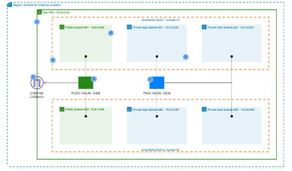
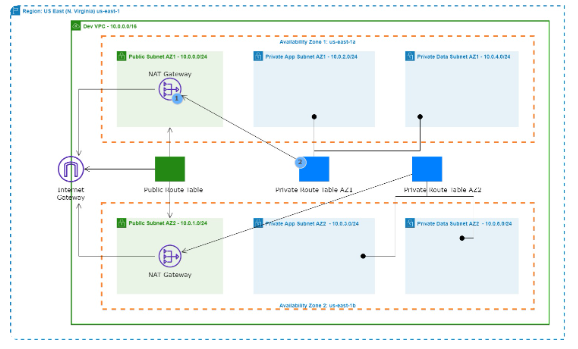
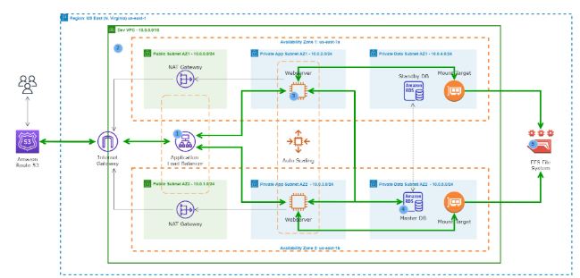
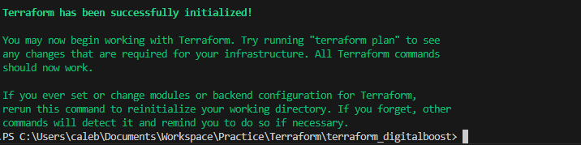
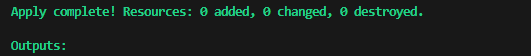
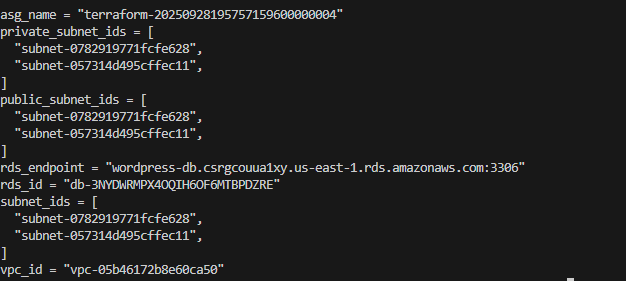

# Terraform Capstone Project: Automated WordPress Deployment on AWS

## Project Scenerio

DigitalBoost, a digital marketing agency, aims to elevate its online presence by launching a high performance WordPress website for their clients.As an AWS Solution Architect, our task is to design and implement a scalable, secure, and cost effective WordPress solutions using various AWS services. Automation through Terraform will be key to achieving a streamlined and reproducable deployment process.

## Project Deliverables

- **Documentation:**
    - Detailed documentation for each component setup
    - Explanation of security measures implemented

- **Demonstation:**
    - Live demonstation of the WordPress site.
    - Showcase auto-scaling by simulating increased traffic

## Project Overview


1. **VPC** with public and private subnets in 2 availability zones

2. An **Internet Gateway** is used to allow communication between instances in VPC and the internet 

3. We are using 2 **availbility zones** for high availability and fault tolerance.

4. Resources such as Nat Gateway, Bastion Host, and Application Load Balancers uses public subnet

5. We will put the webservers and database server in the Private Subnets to protect them.

6. The **Nat Gateway** allows the instances in the private App subnets and private Data subnets to access the internet.

7. We are using an **MySQL RDS** database.

8. We are using Amazon EFS so that the webservers cn have access to shared files.

9. The **EFS Mount Targets** are in each Availability Zones in the VPC

10. We are using **EC2 Instances** to host our website

11. **Application Load Balancer** is used to distribute web traffic accross an Auto Scaling Group of EC2 Instances in multiple AZs

12. Using **Auto-scalling Group** to dynamically create our EC2 instances to make our website highly available scalable, fault tolerance, and elastic

13. We are using **Route 53** to register our domain name and create a record set

## Project Components 

### 1. VPC Setup

**VPC ARCHITECTURE**


1. **VPC** with public and private subnets in 2 availability zones.

2. An **Internet Gateway** is used to allow communication between instances in VPC and the internet.

3. We are using 2 **Availability Zones** for high availability and fault tolerance.

4. Resources such as Nat Gateway, Bastion Host, and Application Load Balancer uses **Public Subnets**.

5. We will put the webserver and database server in the **Private Subnets** to protect them.

6. The **Public Route Table** us associated with the public subnets and routes traffic to the internet through the internet gateway.

7. The **Main Route Table** is associated with the private subnets

#### Objectives and Steps
- **Objective:** Create a Virtual Private Cloud (VPC) to isolate and secure the WordPress infrastructure.

- **Steps**
    - Use Terraform to define VPC, subnet, and route table
    - Leverage variables for customisation
    - Document Terraform commands for execution


### 2. Public and Private Subnet with NAT Gateway
**NAT GATEWAY ARCHITECTURE**



1. The **Nat Gateway** allows the instances in the private App subnets and private Data subnets to access the internet.

2. The **Private Route Table** is associated with the private subnets and routes traffic to the internet through the nat gateway.

#### Objectives and Steps

- **Objective:** Implement a secure network architecture with ublic and private subnets. Use a NAT Gateway for private subnet internet access.

- **Steps:**
    - Utilise Terraform to define subnets, security groups and NAT Gateway
    - Ensure proper association of resources with corresponding subnets
    - Document Terraform commands for execution


### 3. AWS MySQL RDS Setup

**SECURITY GROUP ARCHITECTURE**




1. **ALB Security Group**

    **Port**= 80 and 443       |     **Source**= 0.0.0.0/0

2. **SSH Security Group**

    **Port**=22   | **Source**= Your IP Address

3. **Webserver Security Group**

    **Port**= 80 and 443 | **Source**= ALB Security Group

    **Port**= 22 | **Source**= SSH Security Group

4. **Database Security Group**

    **Port**= 3306 | **Source**= Webserver Security Group

5. **EFS Security Group**

    **Port**=2049 | **Source**= Webserver Security Group,EFS Security Group

    **Port**=22 | **Source**= SSH Security Group

#### Objectives and Steps
- **Objectives:** Deploy a managed MySQL database using Amazon RDS for WordPress data storage.


- **Steps:**
    - Define Terraform scripts for RDS instance creation
    - Confugure security groups and define necessary parameters.
    - Document Terraform commands for execution.

### 4. EFC Setup for WordPress Files 

- **Objective:** Utilise amazon Elastic File System (EFS) to store WordPress files for scalable and shared access.

- **Steps:**
    - Develop Terraform scripts to create an EFS file system.
    - Define configurations for mounting EFS on Wordpress instance
    - Document Terraform commands for execution.

### 5. Application Load Balancer
- **Objective:** Set up an Application Load Balancer to distribute incoming traffic among multiple instances, ensuring high availability and fault tolerance.

- **Steps**
    - Use Terraform to define ALB configurations
    - Intergrate Load Balancer with Auto Scaling Group
    - Document Terraform commands for execution.
### 6. Auto Scaling Group

- **Objective:** Implement Auto Scaling to automatically adjust the number of instances based on traffic load.

- **Steps:**
    - Develop Terraform scripts for Auto Scaling group creation.
    - Define scaling policies and launch configurations.
    - Document Terraform commands for execution.


## Pre-requisites

## Prerequisites

- AWS account with sufficient permissions
- AWS CLI installed and configured (`aws configure`)
- Terraform installed (`terraform -v`)
- Git for version control

Before starting, verify your AWS CLI and Terraform setup:
```bash
aws sts get-caller-identity
terraform -v
```

## Project Structure

There are two ways I can complete the project, these are:

### Monolithic Structure (Single Directory)

~~~
/terraform
  ├── main.tf
  ├── variables.tf
  ├── outputs.tf
  ├── provider.tf
~~~

- **Pros:**

    - Easier to see and manage all resources and their dependencies in one place.
    - Simpler for smaller or medium-sized projects.
    - Easier to reference outputs and variables across resources.

- **Cons:**
    - Can get cluttered as the project grows.
    - Harder to reuse components in other projects.

### Modular Structure (Separate Directories/Modules)

~~~
/terraform
  ├── main.tf
  ├── variables.tf
  ├── outputs.tf
  ├── provider.tf
  └── modules/
       ├── vpc/
       │    ├── main.tf
       │    ├── variables.tf
       │    └── outputs.tf
       ├── nat_gateway/
       ├── rds/
       ├── efs/
       ├── alb/
       └── asg/
~~~

- **Pros:**

    - Promotes reusability and cleaner organization.
    
    - Each component is isolated, making it easier to maintain and test.
    
    - Ideal for larger, more complex projects or if you want to reuse modules elsewhere.
- **Cons:**

    - Slightly more complex to set up and reference outputs/variables between modules.

    - Requires understanding of how to use module blocks and pass variables/outputs.

Since the project is a capstone and covers multiple AWS services that are interlinked, using modules (modular structure) is the best practice:

    - It will help you keep each component (VPC, NAT Gateway, RDS, etc.) organized.
    
    - You can easily reference outputs from one module in another (e.g., VPC ID from the VPC module in the NAT Gateway module).
    
    - It prepares you for real-world DevOps/IaC work.

However, with a monolithic structure if you can do to quickly prototype and see how everything links.

So in this project I will first start a monolithic structure and use clear comments to divide each section (VPC, NAT Gateway, RDS, etc.).

## Directory Setup

1. In the local machine in a desired directory create a new directory.

```bash
mkdir terraform_digitalboost
```

2. Change into that directory

```bash
cd terraform_digitalboost
```

3. Create four `.tf` file 

```bash
touch main.tf
touch variable.tf
touch outputs.tf
touch provider.tf
touch terraform.tfvars
```

This sets up the monotholitic structure

## Task 1: VPC Setup

In this task I will create a VPC with public and private subnets in 2 availability zones.

1. Open the `main.tf` file and add the following code to create a VPC:

```hcl

# --- VPC Setup ---

data "aws_availability_zones" "available" {}

resource "aws_vpc" "vpc_terrform" {
  cidr_block = var.cidr_block
  tags = var.tags
}

resource "aws_subnet" "subnets" {
  count             = length(var.subnet_cidrs)
  vpc_id            = aws_vpc.vpc_terrform.id
  cidr_block        = var.subnet_cidrs[count.index]
  availability_zone = data.aws_availability_zones.available.names[count.index]
  tags              = var.tags
}

resource "aws_internet_gateway" "igw" {
  vpc_id = aws_vpc.vpc_terrform.id
  tags   = var.tags
}

resource "aws_route_table" "public_rt" {
  vpc_id = aws_vpc.vpc_terrform.id
  tags   = var.tags
}

resource "aws_route" "public_route" {
  route_table_id         = aws_route_table.public_rt.id
  destination_cidr_block = "##.##.##.##/0"
  gateway_id             = aws_internet_gateway.igw.id
    depends_on             = [aws_internet_gateway.igw]
}

resource "aws_route_table_association" "public_rt_assoc" {
  count          = length(var.public_subnet_ids)
  subnet_id      = var.public_subnet_ids[count.index]
  route_table_id = aws_route_table.public_rt.id
}

resource "aws_route_table" "private_rt" {
  vpc_id = aws_vpc.vpc_terrform.id
  tags   = var.tags
}

resource "aws_route_table_association" "private_rt_assoc" {
  count          = length(var.private_subnet_ids)
  subnet_id      = var.private_subnet_ids[count.index]
  route_table_id = aws_route_table.private_rt.id
}
```
2. Open the `variables.tf` file and define the variables used in the `main.tf` file:

```hcl

# --- VPC Variables ---
variable "cidr_block" {
  description = "The CIDR block for the VPC"
  type        = string
    default     = "10.0.0.0/16"
}

variable "subnet_cidrs" {
  description = "List of CIDR blocks for the subnets"
  type        = list(string)
  default     = [
    "10.0.1.0/24",
    "10.0.2.0/24",
  ]
  validation {
    condition     = length(var.subnet_cidrs) == 2
    error_message = "You must provide exactly 2 subnet CIDR blocks."
  }
}


variable "tags" {
  description = "A map of tags to assign to the VPC"
  type        = map(string)
  default     = {
    Environment = "Dev"
    Project     = "Terraform-VPC-S3"
  }
}

variable "public_subnet_ids" {
  description = "List of public subnet IDs"
  type        = list(string)
  default     = []
}

variable "private_subnet_ids" {
  description = "List of private subnet IDs"
  type        = list(string)
  default     = []
}
```
3. Open the `outputs.tf` file and define the outputs for the VPC and subnets:

```hcl
# --- VPC Outputs ---

output "vpc_id" {
  description = "The ID of the VPC"
  value       = aws_vpc.vpc_terrform.id
}

output "subnet_ids" {
  description = "List of subnet IDs"
  value       = aws_subnet.subnets[*].id
}
```

4. Open the `provider.tf` file and configure the AWS provider:

```hcl

# --- AWS Provider Configuration ---
provider "aws" {
  region = var.aws_region
}

variable "aws_region" {
  description = "The AWS region to deploy resources"
  type        = string
  default     = "us-east-1"
}
```
5. Open the `terraform.tfvars` file and set the variable values:

```hcl

# --- Terraform Variables ---

aws_region = "us-east-1"
instance_type = "t2.micro"
cidr_block = "10.0.0.01/16
subnet_cidrs = ["10.0.1.0/24","10.0.2.0/24"]
tags = {
  Environment = "Dev"
  Project     = "Terraform-VPC-S3"
}
```

6. Initialize Terraform, plan the deployment, and apply the configuration:

```bash
terraform init
```


We will use the terraform verify command to check the configuration files for syntax errors and internal consistency.

```bash
terraform validate
```


We will not use terraform apply command to create the resources defined in the configuration files. because we do not want to create the resources yet.


## Task 2: Public and Private Subnet with NAT Gateway

In this task I will create a NAT Gateway to allow instances in the private subnets to access the internet.

1. Open the `main.tf` file and add the following code to create a NAT Gateway and associated resources:

```hcl

# --- NAT Gateway Setup ---

resource "aws_eip" "nat_eip" {
  vpc = true
  tags = var.tags
}

resource "aws_nat_gateway" "nat_gw" {
  allocation_id = aws_eip.nat_eip.id
  subnet_id     = element(var.public_subnet_ids, 0)
  tags          = var.tags
  depends_on    = [aws_internet_gateway.igw]
}

resource "aws_route" "private_route" {
  route_table_id         = aws_route_table.private_rt.id
  destination_cidr_block = "10.0.1.0/0"
  nat_gateway_id         = aws_nat_gateway.nat_gw.id
    depends_on             = [aws_nat_gateway.nat_gw]
}
```

2. The variables and outputs for the NAT Gateway are already defined in the previous step, so no changes are needed in `variables.tf` and `outputs.tf`.

3. Initialize Terraform, plan the deployment, and apply the configuration:

We do not need to run `terraform init` again since it has already been initialized.

We will use the terraform verify command to check the configuration files for syntax errors and internal consistency.

```bash
terraform validate
```


We will not use terraform apply command to create the resources defined in the configuration files. because we do not want to create the resources yet.

## Task 3: AWS MySQL RDS Setup

In this task I will create a MySQL RDS instance for WordPress data storage.

1. Open the `main.tf` file and add the following code to create an RDS instance:

```hcl

# --- RDS Setup ---

resource "aws_db_subnet_group" "rds_subnet_group" {
  name       = "rds-subnet-group"
  subnet_ids = var.private_subnet_ids
  tags       = var.tags
}

resource "aws_db_instance" "wordpress_db" {
  identifier              = "wordpress-db"
  engine                  = "mysql"
  instance_class          = var.db_instance_class
  allocated_storage       = var.db_allocated_storage
  name                    = var.db_name
  username                = var.db_username
  password                = var.db_password
  db_subnet_group_name    = aws_db_subnet_group.rds_subnet_group.name
  vpc_security_group_ids  = [aws_security_group.db_sg.id]
  skip_final_snapshot     = true
  publicly_accessible     = false
  multi_az                = false
  tags                    = var.tags
}
```


2. Open the `variables.tf` file and define the variables used in the RDS configuration:

```hcl

# --- RDS Variables ---

variable "db_instance_class" {
  description = "The instance class for the RDS instance"
  type        = string
  default     = "db.t2.micro"
}

variable "db_allocated_storage" {
  description = "The allocated storage in GB for the RDS instance"
  type        = number
  default     = 20
}

variable "db_name" {
  description = "The name of the database"
  type        = string
  default     = "wordpress"
}

variable "db_username" {
  description = "The username for the database"
  type        = string
  default     = "admin"
}

variable "db_password" {
  description = "The password for the database"
  type        = string
  default     = "YourPassword123!"
  sensitive   = true
}
variable "db_port" {
  description = "The port for the database"
  type        = number
  default     = 3306
}
```

3. Open the `outputs.tf` file and define the outputs for the RDS instance:

```hcl

# --- RDS Outputs ---
output "rds_endpoint" {
  description = "The endpoint of the RDS instance"
  value       = aws_db_instance.wordpress_db.endpoint
}
output "rds_id" {
  description = "The ID of the RDS instance"
  value       = aws_db_instance.wordpress_db.id
}
```
4. The provider configuration in `provider.tf` remains unchanged.

5. Open the `terraform.tfvars` file and set the variable values for the RDS instance:

```hcl
# --- Terraform Variables ---
db_instance_class = "db.t2.micro"
db_allocated_storage = 20
db_name = "wordpress"
db_username = "admin"
db_password = "YourPassword123!"
db_port = 3306
```

6. Initialize Terraform, plan the deployment, and apply the configuration:

We do not need to run `terraform init` again since it has already been initialized.

We will use the terraform verify command to check the configuration files for syntax errors and internal consistency.

```bash
terraform validate
```


We will not use terraform apply command to create the resources defined in the configuration files. because we do not want to create the resources yet.

## Task 4: EFS Setup for WordPress Files

In this task I will create an EFS file system for shared WordPress files.

1. Open the `main.tf` file and add the following code to create an EFS file system and associated resources:

```hcl

# --- EFS Setup ---

resource "aws_efs_file_system" "efs" {
  creation_token = "wordpress-efs"
  tags           = var.tags
    lifecycle {
        prevent_destroy = true
    }
}
resource "aws_efs_mount_target" "efs_mount" {
  count          = length(var.private_subnet_ids)
  file_system_id = aws_efs_file_system.efs.id
  subnet_id      = var.private_subnet_ids[count.index]
  security_groups = [aws_security_group.efs_sg.id]
}
```

2. The variables and outputs for the EFS are already defined in the previous steps, so no changes are needed in `variables.tf` and `outputs.tf`.

3. Initialize Terraform, plan the deployment, and apply the configuration:

We do not need to run `terraform init` again since it has already been initialized.

We will use the terraform verify command to check the configuration files for syntax errors and internal consistency.

```bash
terraform validate
```


We will not use terraform apply command to create the resources defined in the configuration files. because we do not want to create the resources yet.

## Task 5: Application Load Balancer

In this task I will create an Application Load Balancer to distribute incoming traffic among multiple instances.

1. Open the `main.tf` file and add the following code to create an Application Load Balancer and associated resources:

```hcl
# --- Application Load Balancer Setup ---

resource "aws_lb" "alb" {
  name               = "wordpress-alb"
  internal          = false
  load_balancer_type = "application"
  security_groups   = [aws_security_group.alb_sg.id]
  subnets           = var.public_subnet_ids
  tags              = var.tags
}
resource "aws_lb_target_group" "alb_target_group" {
  name     = "wordpress-tg"
  port     = 80
  protocol = "HTTP"
  vpc_id   = aws_vpc.vpc_terrform.id
  health_check {
    path                = "/"
    interval            = 30
    timeout             = 5
    healthy_threshold   = 5
    unhealthy_threshold = 2
    matcher             = "200-399"
  }
  tags = var.tags
}
resource "aws_lb_listener" "alb_listener" {
  load_balancer_arn = aws_lb.alb.arn
  port              = "80"
  protocol          = "HTTP"
  default_action {
    type             = "forward"
    target_group_arn = aws_lb_target_group.alb_target_group.arn
  }
}
```
2. The variables and outputs for the Application Load Balancer are already defined in the previous steps, so no changes are needed in `variables.tf` and `outputs.tf`.

3. Initialize Terraform, plan the deployment, and apply the configuration:

We do not need to run `terraform init` again since it has already been initialized.

We will use the terraform verify command to check the configuration files for syntax errors and internal consistency.

```bash
terraform validate
```


We will not use terraform apply command to create the resources defined in the configuration files. because we do not want to create the resources yet.

## Task 6: Auto Scaling Group

In this task I will create an Auto Scaling Group to automatically adjust the number of instances based on traffic load.

1. Open the `main.tf` file and add the following code to create an Auto Scaling Group and associated resources:

```hcl

# --- Auto Scaling Group Setup ---
resource "aws_launch_configuration" "lc" {
  name_prefix          = "wordpress-lc-"
  image_id             = var.ami_id
  instance_type        = var.instance_type
  security_groups      = [aws_security_group.web_sg.id]
  user_data            = file("user_data.sh")
  associate_public_ip_address = false
  lifecycle {
    create_before_destroy = true
  }
}
resource "aws_autoscaling_group" "asg" {
  desired_capacity     = var.asg_desired_capacity
  max_size             = var.asg_max_size
  min_size             = var.asg_min_size
  vpc_zone_identifier  = var.private_subnet_ids
  launch_configuration = aws_launch_configuration.lc.name
  target_group_arns    = [aws_lb_target_group.alb_target_group.arn]
  tags = [
    {
      key                 = "Name"
      value               = "wordpress-instance"
      propagate_at_launch = true
    },
    {
      key                 = "Environment"
      value               = "Dev"
      propagate_at_launch = true
    },
    {
      key                 = "Project"
      value               = "Terraform-VPC-S3"
      propagate_at_launch = true
    }
  ]
  lifecycle {
    create_before_destroy = true
  }
}
```
2. Open the `variables.tf` file and define the variables used in the Auto Scaling Group configuration:

```hcl
# --- Auto Scaling Group Variables ---
variable "ami_id" {
  description = "The AMI ID for the EC2 instances"
  type        = string
  default     = "ami-0c55b159cbfafe1f0" # Amazon Linux 2 AMI (HVM), SSD Volume Type
}
variable "instance_type" {
  description = "The instance type for the EC2 instances"
  type        = string
  default     = "t2.micro"
}
variable "asg_desired_capacity" {
  description = "The desired capacity of the Auto Scaling Group"
  type        = number
  default     = 2
}
variable "asg_max_size" {
  description = "The maximum size of the Auto Scaling Group"
  type        = number
  default     = 3
}
variable "asg_min_size" {
  description = "The minimum size of the Auto Scaling Group"
  type        = number
  default     = 1
}
```
3. Open the `outputs.tf` file and define the outputs for the Auto Scaling Group:

```hcl
# --- Auto Scaling Group Outputs ---
output "asg_name" {
  description = "The name of the Auto Scaling Group"
  value       = aws_autoscaling_group.asg.name
}
output "asg_instances" {
  description = "List of instance IDs in the Auto Scaling Group"
  value       = aws_autoscaling_group.asg.instances
}
```
4. The provider configuration in `provider.tf` remains unchanged.

5. Open the `terraform.tfvars` file and set the variable values for the Auto Scaling Group:

```hcl
# --- Terraform Variables ---
ami_id = "ami-0c55b159cbfafe1f0" # Amazon Linux 2 AMI (HVM), SSD Volume Type
instance_type = "t2.micro"
asg_desired_capacity = 2
asg_max_size = 3
asg_min_size = 1
```
6. User Data Script

Create a file named `user_data.sh` in the same directory as your Terraform configuration files. This script will be executed when each EC2 instance is launched, installing and configuring WordPress to connect to the RDS database.


```bash

##1. create the html directory and mount the efs to it
sudo su
yum update -y
mkdir -p /var/www/html
sudo mount -t nfs4 -o nfsvers=4.1,rsize=1048576,wsize=1048576,hard,timeo=600,retrans=2,noresvport fs-03c9b3354880b36a6.efs.us-east-1.amazonaws.com:/ /var/www/html


#2. install apache 
sudo yum install -y httpd httpd-tools mod_ssl
sudo systemctl enable httpd 
sudo systemctl start httpd


#3. install php 7.4
sudo amazon-linux-extras enable php7.4
sudo yum clean metadata
sudo yum install php php-common php-pear -y
sudo yum install php-{cgi,curl,mbstring,gd,mysqlnd,gettext,json,xml,fpm,intl,zip} -y


#4. install mysql5.7
sudo rpm -Uvh https://dev.mysql.com/get/mysql57-community-release-el7-11.noarch.rpm
sudo rpm --import https://repo.mysql.com/RPM-GPG-KEY-mysql-2022
sudo yum install mysql-community-server -y
sudo systemctl enable mysqld
sudo systemctl start mysqld


#5. set permissions
sudo usermod -a -G apache ec2-user
sudo chown -R ec2-user:apache /var/www
sudo chmod 2775 /var/www && find /var/www -type d -exec sudo chmod 2775 {} \;
sudo find /var/www -type f -exec sudo chmod 0664 {} \;
chown apache:apache -R /var/www/html 


#6. download wordpress files
wget https://wordpress.org/latest.tar.gz
tar -xzf latest.tar.gz
cp -r wordpress/* /var/www/html/


#7. create the wp-config.php file
cp /var/www/html/wp-config-sample.php /var/www/html/wp-config.php


#8. edit the wp-config.php file
nano /var/www/html/wp-config.php


#9. restart the webserver
service httpd restart
```

This script performs the following actions:

    1. Updates the system and mounts the EFS file system to `/var/www/html`.

    2. Installs Apache web server and starts the service.

    3. Installs PHP 7.4 and necessary PHP extensions for WordPress.

    4. Installs MySQL 5.7 (though in this case, we will be using RDS for the database).

    5. Sets the appropriate permissions for the web server.

    6. Downloads and extracts the latest WordPress files to the web server's root directory.

    7. Creates a `wp-config.php` file from the sample provided by WordPress.

    8. Opens the `wp-config.php` file for editing (you will need to manually edit this file to add your RDS database details).

    9. Restarts the Apache web server to apply changes.

6. Initialize Terraform, plan the deployment, and apply the configuration:

We do not need to run `terraform init` again since it has already been initialized.

We will use the terraform verify command to check the configuration files for syntax errors and internal consistency.

```bash
terraform validate
```


We will now use terraform apply command to create the resources defined in the configuration files.

```bash
terraform apply
```



This will create all the resources defined in the `main.tf` file, including the VPC, subnets, NAT Gateway, RDS instance, EFS file system, Application Load Balancer, and Auto Scaling Group.

We do not need to confirm if every resource is created successfully because terraform will automatically handle the creation of resources and will provide output if any resource fails to create. Also if successful we wil be able to get access to the wordpress website using the DNS name of the Application Load Balancer.
## Accessing the WordPress Site

Once the `terraform apply` command completes successfully, you can access the WordPress site using the DNS name of the Application Load Balancer. You can find this DNS name in the output of the `terraform apply` command or by checking the AWS Management Console under the EC2 section, then navigating to Load Balancers.




### The full file looks like this:

The full `main.tf` file looks like this:
```hcl
# --- VPC Setup ---

data "aws_availability_zones" "available" {}

resource "aws_vpc" "vpc_terrform" {
  cidr_block = var.cidr_block
  tags = var.tags
}

resource "aws_subnet" "subnets" {
  count                   = length(var.subnet_cidrs)
  vpc_id                  = aws_vpc.vpc_terrform.id
  cidr_block              = var.subnet_cidrs[count.index]
  availability_zone       = data.aws_availability_zones.available.names[count.index]
  map_public_ip_on_launch = true
  tags                    = var.tags
}

resource "aws_internet_gateway" "igw" {
  vpc_id = aws_vpc.vpc_terrform.id
  tags   = var.tags
}

resource "aws_route_table" "public_rt" {
  vpc_id = aws_vpc.vpc_terrform.id
  tags   = var.tags
}

resource "aws_route" "public_route" {
  route_table_id         = aws_route_table.public_rt.id
  destination_cidr_block = "0.0.0.0/0"
  gateway_id             = aws_internet_gateway.igw.id
    depends_on             = [aws_internet_gateway.igw]
}

resource "aws_route_table_association" "public_rt_assoc" {
  subnet_id      = aws_subnet.subnets[0].id
  route_table_id = aws_route_table.public_rt.id
}

resource "aws_route_table" "private_rt" {
  vpc_id = aws_vpc.vpc_terrform.id
  tags   = var.tags
}

resource "aws_route_table_association" "private_rt_assoc" {
  subnet_id      = aws_subnet.subnets[1].id
  route_table_id = aws_route_table.private_rt.id
}

# ---------------------------------------------------------------------------------

# --- NAT Gateway Setup ---

resource "aws_eip" "nat_eip" {
  tags = var.tags
}

resource "aws_nat_gateway" "nat_gw" {
  allocation_id = aws_eip.nat_eip.id
  subnet_id     = aws_subnet.subnets[0].id
  tags          = var.tags
  depends_on    = [aws_internet_gateway.igw]
}

resource "aws_route" "private_route" {
  route_table_id         = aws_route_table.private_rt.id
  destination_cidr_block = "0.0.0.0/0"
  nat_gateway_id         = aws_nat_gateway.nat_gw.id
  depends_on             = [aws_nat_gateway.nat_gw]
}

# ------------------------------

# --- RDS Setup ---

resource "aws_db_subnet_group" "rds_subnet_group" {
  name       = "rds-subnet-group"
  subnet_ids = aws_subnet.subnets[*].id
  tags       = var.tags
}

resource "aws_security_group" "db_sg" {
  name        = "db-sg"
  description = "Allow MySQL inbound traffic"
  vpc_id      = aws_vpc.vpc_terrform.id

  ingress {
    from_port   = 3306
    to_port     = 3306
    protocol    = "tcp"
    cidr_blocks = ["10.0.0.0/16"] # Adjust as needed for your app servers
  }

  egress {
    from_port   = 0
    to_port     = 0
    protocol    = "-1"
    cidr_blocks = ["0.0.0.0/0"]
  }

  tags = var.tags
}

resource "aws_db_instance" "wordpress_db" {
  identifier              = "wordpress-db"
  engine                  = "mysql"
  instance_class          = var.db_instance_class
  allocated_storage       = var.db_allocated_storage
  # name                  = var.db_name   # <-- Remove or comment out this line
  username                = var.db_username
  password                = var.db_password
  db_subnet_group_name    = aws_db_subnet_group.rds_subnet_group.name
  vpc_security_group_ids  = [aws_security_group.db_sg.id]
  skip_final_snapshot     = true
  publicly_accessible     = false
  multi_az                = false
  tags                    = var.tags
}

#--------------------------------------------------------------------

# --- EFS Setup ---

resource "aws_security_group" "efs_sg" {
  name        = "efs-sg"
  description = "Allow NFS traffic for EFS"
  vpc_id      = aws_vpc.vpc_terrform.id

  ingress {
    from_port   = 2049
    to_port     = 2049
    protocol    = "tcp"
    cidr_blocks = ["10.0.0.0/16"] # Adjust as needed
  }

  egress {
    from_port   = 0
    to_port     = 0
    protocol    = "-1"
    cidr_blocks = ["0.0.0.0/0"]
  }

  tags = var.tags
}

resource "aws_efs_file_system" "efs" {
  creation_token = "wordpress-efs"
  tags           = var.tags
    lifecycle {
        prevent_destroy = true
    }
}
resource "aws_efs_mount_target" "efs_mount" {
  count          = 1
  subnet_id      = aws_subnet.subnets[1].id
  file_system_id = aws_efs_file_system.efs.id
  security_groups = [aws_security_group.efs_sg.id]
}

# ------------------------------------------------------------------------

# --- Application Load Balancer Setup ---

resource "aws_security_group" "alb_sg" {
  name        = "alb-sg"
  description = "Allow HTTP inbound traffic to ALB"
  vpc_id      = aws_vpc.vpc_terrform.id

  ingress {
    from_port   = 80
    to_port     = 80
    protocol    = "tcp"
    cidr_blocks = ["0.0.0.0/0"]
  }

  egress {
    from_port   = 0
    to_port     = 0
    protocol    = "-1"
    cidr_blocks = ["0.0.0.0/0"]
  }

  tags = var.tags
}

resource "aws_lb" "alb" {
  name               = "wordpress-alb"
  internal           = false
  load_balancer_type = "application"
  security_groups    = [aws_security_group.alb_sg.id]
  subnets            = [aws_subnet.subnets[0].id, aws_subnet.subnets[1].id]
  tags               = var.tags
}
resource "aws_lb_target_group" "alb_target_group" {
  name     = "wordpress-tg"
  port     = 80
  protocol = "HTTP"
  vpc_id   = aws_vpc.vpc_terrform.id
  health_check {
    path                = "/"
    interval            = 30
    timeout             = 5
    healthy_threshold   = 5
    unhealthy_threshold = 2
    matcher             = "200-399"
  }
  tags = var.tags
}
resource "aws_lb_listener" "alb_listener" {
  load_balancer_arn = aws_lb.alb.arn
  port              = "80"
  protocol          = "HTTP"
  default_action {
    type             = "forward"
    target_group_arn = aws_lb_target_group.alb_target_group.arn
  }
}

output "alb_dns_name" {
  value = aws_lb.alb.dns_name
}

#-----------------------------------------------------------------------------

# --- Auto Scaling Group Setup ---


resource "aws_launch_template" "wordpress_lt" {
  name_prefix   = "wordpress-lt-"
  image_id      = var.ami_id
  instance_type = var.instance_type

  user_data = filebase64("user_data.sh")

  vpc_security_group_ids = [aws_security_group.web_sg.id]

  network_interfaces {
    associate_public_ip_address = true
    security_groups             = [aws_security_group.web_sg.id]
  }

  tag_specifications {
    resource_type = "instance"
    tags          = var.tags
  }
}

data "aws_autoscaling_group" "asg" {
  name = aws_autoscaling_group.asg.name
}

resource "aws_security_group" "web_sg" {
  name        = "web-sg"
  description = "Allow HTTP and SSH to web servers"
  vpc_id      = aws_vpc.vpc_terrform.id

  ingress {
    from_port   = 80
    to_port     = 80
    protocol    = "tcp"
    cidr_blocks = ["0.0.0.0/0"]
  }

  ingress {
    from_port   = 22
    to_port     = 22
    protocol    = "tcp"
    cidr_blocks = ["0.0.0.0/0"]
  }

  egress {
    from_port   = 0
    to_port     = 0
    protocol    = "-1"
    cidr_blocks = ["0.0.0.0/0"]
  }

  tags = var.tags
}

resource "aws_autoscaling_group" "asg" {
  desired_capacity     = var.asg_desired_capacity
  max_size            = var.asg_max_size
  min_size            = var.asg_min_size
  vpc_zone_identifier = [aws_subnet.subnets[0].id]
  target_group_arns = [aws_lb_target_group.alb_target_group.arn]

  launch_template {
    id      = aws_launch_template.wordpress_lt.id
    version = "$Latest"
  }

  tag {
    key                 = "Name"
    value               = "wordpress-asg"
    propagate_at_launch = true
  }

  # Add more tag blocks if needed:
  tag {
    key                 = "Environment"
    value               = "Dev"
    propagate_at_launch = true
  }
  tag {
    key                 = "Project"
    value               = "Terraform-VPC-S3"
    propagate_at_launch = true
  }
}

# ----------------------------------------------------------------------------


```

The full `variables.tf` file looks like this:
```hcl
# --- VPC Variables ---
variable "cidr_block" {
  description = "The CIDR block for the VPC"
  type        = string
    default     = "10.0.0.0/16"
}

variable "subnet_cidrs" {
  description = "List of CIDR blocks for the subnets"
  type        = list(string)
  default     = [
    "10.0.3.0/24",
    "10.0.4.0/24",
  ]
  validation {
    condition     = length(var.subnet_cidrs) == 2
    error_message = "You must provide exactly 2 subnet CIDR blocks."
  }
}


variable "tags" {
  description = "A map of tags to assign to the VPC"
  type        = map(string)
  default     = {
    Environment = "Dev"
    Project     = "Terraform-VPC-S3"
  }
}

variable "public_subnet_ids" {
  description = "List of public subnet IDs"
  type        = list(string)
  default     = []
}

variable "private_subnet_ids" {
  description = "List of private subnet IDs"
  type        = list(string)
  default     = []
}

# -------------------------------------------------------------------------

# --- RDS Variables ---

variable "db_instance_class" {
  description = "The instance class for the RDS instance"
  type        = string
  default     = "db.t2.micro"
}

variable "db_allocated_storage" {
  description = "The allocated storage in GB for the RDS instance"
  type        = number
  default     = 20
}

variable "db_name" {
  description = "The name of the database"
  type        = string
  default     = "wordpress"
}

variable "db_username" {
  description = "The username for the database"
  type        = string
  default     = "admin"
}

variable "db_password" {
  description = "The password for the database"
  type        = string
  default     = "YourPassword123!"
  sensitive   = true
}
variable "db_port" {
  description = "The port for the database"
  type        = number
  default     = 3306
}

#-----------------------------------------------------------------------

# --- Auto Scaling Group Variables ---
variable "ami_id" {
  description = "The AMI ID for the EC2 instances"
  type        = string
  default     = "ami-08982f1c5bf93d976" # Amazon Linux 2 AMI (HVM), SSD Volume Type
}
variable "instance_type" {
  description = "The instance type for the EC2 instances"
  type        = string
  default     = "t2.micro"
}
variable "asg_desired_capacity" {
  description = "The desired capacity of the Auto Scaling Group"
  type        = number
  default     = 2
}
variable "asg_max_size" {
  description = "The maximum size of the Auto Scaling Group"
  type        = number
  default     = 3
}
variable "asg_min_size" {
  description = "The minimum size of the Auto Scaling Group"
  type        = number
  default     = 1
}
#--------------------------------------------------------------------

```

The full `outputs.tf` file looks like this:
```hcl
# --- VPC Outputs ---

output "vpc_id" {
  description = "The ID of the VPC"
  value       = aws_vpc.vpc_terrform.id
}

output "subnet_ids" {
  description = "List of subnet IDs"
  value       = aws_subnet.subnets[*].id
}

output "public_subnet_ids" {
  value = aws_subnet.subnets[*].id
}
output "private_subnet_ids" {
  value = aws_subnet.subnets[*].id
}

# --------------------------------------------

# --- RDS Outputs ---
output "rds_endpoint" {
  description = "The endpoint of the RDS instance"
  value       = aws_db_instance.wordpress_db.endpoint
}
output "rds_id" {
  description = "The ID of the RDS instance"
  value       = aws_db_instance.wordpress_db.id
}

#--------------------------------------------------------------------------

# --- Auto Scaling Group Outputs ---
output "asg_name" {
  description = "The name of the Auto Scaling Group"
  value       = aws_autoscaling_group.asg.name
}

# output "asg_instances" {
#   description = "List of instance IDs in the Auto Scaling Group"
#   value       = data.aws_autoscaling_group.asg.instance_ids
# }

#------------------------------------------------------------------------

```

The full `provider.tf` file looks like this:
```hcl
# --- AWS Provider Configuration ---
provider "aws" {
  region = var.aws_region
}

variable "aws_region" {
  description = "The AWS region to deploy resources"
  type        = string
  default     = "us-east-1"
}

```

The full `terraform.tfvars` file looks like this:
```hcl
# --- Terraform Variables ---

aws_region = "us-east-1"
instance_type = "t2.micro"
cidr_block = "10.0.0.0/16"
subnet_cidrs = ["10.0.1.0/24","10.0.2.0/24"]
tags = {
  Environment = "Dev"
  Project     = "Terraform-VPC-S3"
}

db_instance_class = "db.t3.micro"
db_allocated_storage = 20
db_name = "wordpress"
db_username = "admin"
db_password = "YourPassword123!"
db_port = 3306

ami_id = "ami-08982f1c5bf93d976"
asg_desired_capacity = 2
asg_max_size = 3
asg_min_size = 1

```

The full `user_data.sh` file looks like this:
```bash
#!/bin/bash
yum update -y
yum install -y httpd wget php php-mysqlnd
systemctl enable httpd
systemctl start httpd

wget https://wordpress.org/latest.tar.gz
tar -xzf latest.tar.gz
cp -r wordpress/* /var/www/html/
chown -R apache:apache /var/www/html

cp /var/www/html/wp-config-sample.php /var/www/html/wp-config.php
systemctl restart httpd
```

This completes the Terraform Capstone Project: Automated WordPress Deployment on AWS. You now have a scalable, secure, and cost-effective WordPress solution deployed on AWS using Terraform.

## Cleanup

To avoid incurring unnecessary costs, remember to destroy the resources created by Terraform when they are no longer needed. You can do this by running:

```bash
terraform destroy
``` 

## Troubleshooting

These are some common issues you might encounter and their solutions:

1. **Insufficient Permissions**: Ensure that the AWS credentials you are using have the necessary permissions to create the resources defined in your Terraform configuration.

2. **Resource Limits**: AWS has limits on the number of certain resources you can create. If you encounter errors related to resource limits, check your AWS account limits and request an increase if necessary.

3. **Network Issues**: If your instances cannot connect to the internet or other AWS services, check your VPC, subnet, and security group configurations to ensure they allow the necessary traffic.

4. **RDS Connection Issues**: If WordPress cannot connect to the RDS database, verify that the database endpoint, username, and password in the `wp-config.php` file are correct. Also, ensure that the security group for the RDS instance allows inbound traffic from the web server instances.

5. **EC2 Instance Issues**: The Public IP address is not assigned to the instances in the private subnet. Ensure that your instances are in the correct subnet and that the subnet has a route to the NAT Gateway for internet access.

6. **EFS Mount Issues**: If the EFS file system is not mounting correctly, ensure that the security group for EFS allows inbound NFS traffic (port 2049) from the web server instances.

7. **Load Balancer Issues**: If the Application Load Balancer is not routing traffic correctly, check the target group health checks and ensure that the instances are healthy and registered with the target group.

8. **Auto Scaling Issues**: If the Auto Scaling Group is not launching instances as expected, check the launch configuration/template, desired capacity, and scaling policies.

9. **Terraform State Issues**: If you encounter issues with the Terraform state file, consider using remote state storage (e.g., S3 with DynamoDB for state locking) to avoid conflicts and ensure consistency.

10. **Debugging**: Use the `terraform plan` command to preview changes before applying them. This can help identify potential issues in your configuration.

11. **User Data Script Issues**: If the user data script is not executing as expected, check the instance system logs in the AWS Management Console for any errors during startup.

## Conclusion

This project demonstrated the use of Terraform to automate the deployment of a WordPress website on AWS. By leveraging various AWS services such as VPC, RDS, EFS, ALB, and Auto Scaling, we created a robust and scalable infrastructure that meets the needs of a digital marketing agency. The modular approach to infrastructure as code ensures that the setup is maintainable and reusable for future projects.

